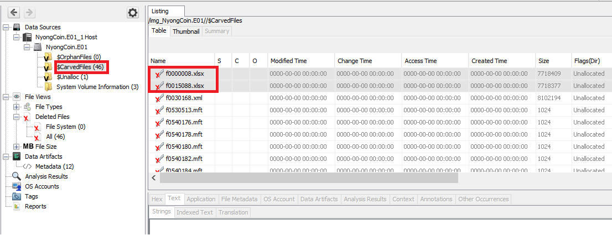

# Nyong Coin

## Description
- Download file: [link](https://drive.google.com/file/d/1F0-26SjSeCoixKtSY0E0keBFzsOVkRTd/view?usp=sharing)

```
'Kim' is the CEO of a cryptocurrency exchange 'A'. 
He asked the management team for the full transaction history of 'NYONG coin' traded in a specific period.
And here is 'Lee', a member of the management team who hates 'Kim', delivered a maliciously manipulated transaction history to 'Kim' in a USB.
Analyze the USB and find one manipulated transaction in there!
Flag: ACSC{lowercase(MANIPULATED_TRANSACTION_ID)}
```

## Solution

### Brief (2 ways)

#### 1. Using tools

1. Using `Autopsy` to identify and carve deleted `xlsx` file from image file.
2. The deleted file will be similar to 1 file in the main space -> identify that.
3. Text diff 2 files to find the differences. The difference row is the answer

#### 2. Using knowledge

1. History to data inserted is preserved in `xl/sharedStrings.xml` (*no log formatted strings such as `date, currency, scientific, etc.`*)
2. `PhoneticPr` attribute is used to provide a phonetic hint for a string, only generate when **data is typed**, not **Copy&Paste**

### Details

#### 1. Using tools

The downloaded file has a `E01` extensions, which indicates an image dump from NetWitness.

```console
$ file NyongCoin.E01
NyongCoin.E01: EWF/Expert Witness/EnCase image file format
```

These file can be viewed and analysed using tools like `FTK Imager`, `Autopsy` or `ProDiscover`.

> In my case, I noticed hex data of a xlsx file in the unallocated space in FTK Imager but decided not to carve the file out (outstanding move 🤡). Therefore I didn't finnish the challlenge.

To solve the challenge (or any other image forensics challenges), best use tools is `Autopsy`.

- After import image to `autopsy`, go to **CarvedFiles** then export xlsx files (*the data in 2 files are the same so take 1 file only*).



- Identify the original file by checking the fist row data of every files.

- Go to [TextCompare.org](https://www.textcompare.org/excel/), upload the exported file (*carved file*) and the original file and then compare.


The answer is: `8d77a554-dc64-478c-b093-da4493a8534d`

> Flag: ACSC{8d77a554-dc64-478c-b093-da4493a8534d}

#### 2. Using knowledge

- **Extract** all xlsx file as zip to a folder then Grep `PhoneticPr` in all **sharedString.xml** files.

```console
$ for file in `find . -name sharedStrings.xml`;do grep -Hoi "phoneticPr" $file;done
./20200715132932_20200816181652/xl/sharedStrings.xml:phoneticPr
```

- Finding the id (*you can just view in text editor*):

```console
$ grep -Eo "phoneticPr.*$" ./20200715132932_20200816181652/xl/sharedStrings.xml
phoneticPr fontId="1" type="noConversion"/></si><si><t>8d77a554-dc64-478c-b093-da4493a8534d</t><phoneticPr fontId="1" type="noConversion"/></si></sst>
```